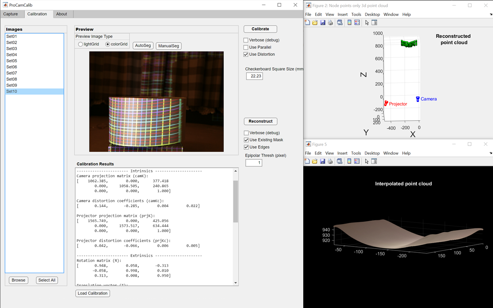
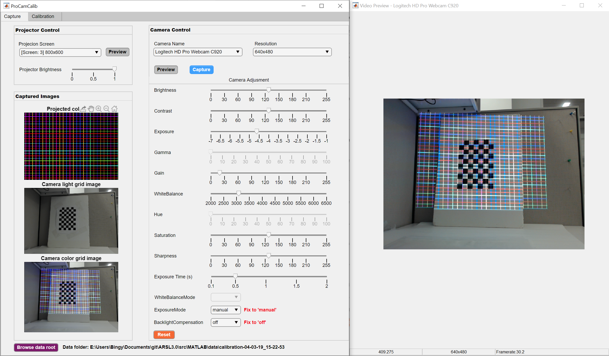

A Single-shot-per-pose Camera-Projector Calibration System For Imperfect Planar Targets
===

## Introduction
A single-shot-per-pose camera-projector calibration method that deals with imperfect planarity of the calibration target. 

Highlights:
* The proposed method performs camera-projector pair calibration with only a single-shot-per-pose, making it practically convenient in many applications. It can provide flexible and accurate results even when the board is handheld.
* A bundle adjustment (BA) algorithm is developed to jointly optimize the estimated camera/projector models and feature points in model space. 
* Unlike many existing methods, to calibrate the system, we apply points from a **Structured Light (SL) pattern** rather than from a checkerboard. This strategy boosts not only the number of feature points but also their spatial distribution, and hence improves calibration robustness.

For more info please refer to our [paper][1]. **To reproduce paper results please refer to [ismar18][5] branch.**

**Updated 04/03/2019: 3D reconstruction feature released**. Click `Calibration` tab and load a calibration yml file by clicking `Load Calibration`, then select a set in the `Images` list and click `Reconstruct`.

## Usage
#### Required Software & Packages
* MATLAB >= 2018b
* [mexOpenCV v3.3.0][2]

#### Build from source
1. Clone this repo and install mexOpenCV.
3. Run `calibApp.mlapp` to start the App.

#### Windows binary
1. Check [release](https://github.com/BingyaoHuang/single-shot-pro-cam-calib/releases) for Windows installer.

## Tutorial
1. Watch a short video tutorial [here][6].

----
### Calibrate your own camera-projector pair using our GUI

1. Print a checkerboard pattern and glue it to a white board. Make sure the checkerboard pattern is at the center of the white board and its width/height is around **1/3** of the white board's width/height.
2. Place the white board (with checkerboard glued to it) in front of camera and projector.
3. Run `calibApp.mlapp` to start the GUI.
4. In the GUI, select the projector screen in the top-left `Projector Control` panel dropdown, then click `Preview` on the right of the dropdown to preview the projected structured light pattern.
5. Then select the camera in the top-right `Camera Control` panel, click `Preview` button to start camera review, make sure the white board is in camera's and projector's FOV, i.e, the color grid covers the entire white board and the camera has a full view of the white board.
6. Adjust the projector color grid brightness using the `Projector Brightness` slider and camera parameters using the sliders in `Camera Control` panel. Make sure the color grid is not underexposed or overexposed.
7. Start to capture the images as shown in the gif below. The checkerboard and color grid images will be saved as `lightGrid[i].png` and `colorGrid[i].png`, where `i` is the ith position, e.g.,  `colorGrid01.png` is the color grid image at the 1st position. Although **at least three poses** are sufficient we highly encourage to take more, refer to [Bouguet][7] for a good example.
8. Once sufficient images are captured, click `Calibration` tab on top and select the sets you want to use for calibration, then type the printed checkerboard square size in the text box below `Calibrate` button. Finally click `Calibrate` button.

## Example Results
* Reprojection error:

    | Method              | Camera  | Projector | Stereo  |
    |---------------------|---------|-----------|---------|
    |[Moreno & Taubin][3] | 0.12356 | 1.5949    | 1.1311  |
    | Global homography   | 0.12356 | 5.7868    | 4.0928  |
    | Proposed w/o BA     | 0.41692 | 0.7105    | 0.5825  |
    | Proposed            | 0.34976 | 0.6352    | 0.5127  |

* 3D alignment error:
    
    After we calibrate the camera-projector pair, we reconstruct a point cloud using [2D structured light point pairs](https://github.com/BingyaoHuang/single-shot-pro-cam-calib/tree/ismar18/data/calibration-11-13-17/MT/Set10.yml) and [calibration data](https://github.com/BingyaoHuang/single-shot-pro-cam-calib/tree/ismar18/data/calibration-11-13-17/results). To calculate reconstruction accuracy, we also capture the [ground truth point cloud](https://github.com/BingyaoHuang/single-shot-pro-cam-calib/tree/ismar18/data/calibration-11-13-17/recon-10.ply) using an Intel RealSense F200 RGBD camera. The point cloud 3D alignment error (Euclidean distance) between the reconstructed point cloud and the ground truth point cloud are given by:

    | Method              | Min      | Max    | Mean   | Median | Std.   |
    |---------------------|----------|--------|--------|--------|--------|
    |[Moreno & Taubin][3] | 0.088551 | 55.194 | 8.4722 | 7.0756 | 5.9264 |
    | Global homography   | 0.016244 | 73.173 | 11.877 | 11.94  | 9.9919 |
    | Proposed w/o BA     | 0.046634 | 48.834 | 6.7798 | 6.8835 | 4.1002 |
    | Proposed            | 0.057853 | 50.807 | 5.5959 | 4.5881 | 4.7023 |

    The per-point 3D alignment error can be viewed in pseudocolor:

    

 
## Folder Structure
The project folder is organized as follows:

    ├─+Calibration                                  calibration package directory
    ├─+ImgProc                                      image processing package directory
    ├─+Reconstruct                                  3d reconstruction package directory
    ├─data                                          directory for data
    │  ├─calibration-04-01-19_16-02-01              directory for real data, contains checkerboard/structured light images and RealSense reconstructed ply files.
    │  │  ├─matlabCorners                           extracted checkerboard corners by MATLAB's detectCheckerboardPoints and warped corners by the global homography             
    │  │  └─results                                 calibration results generated by the four methods mention in the paper with real data
    │  └─simulation                                 directory for simulation (synthetic) data
    │      └─results                                calibration results generated by the four methods mention in the paper with synthetic data
    ├─doc                                           directory for documentation
    └─README.md                                     this file
    
## Citation
Please cite these papers in your publications if it helps your research:

    @inproceedings{huang2018single,
        title={A Single-shot-per-pose Camera-Projector Calibration System For Imperfect Planar Targets},
        author={Huang, Bingyao and Ozdemir, Samed and Tang, Ying and Liao, Chunyuan and Ling, Haibin},
        booktitle={2018 IEEE International Symposium on Mixed and Augmented Reality Adjunct (ISMAR-Adjunct)},
        pages={15--20},
        year={2018},
        organization={IEEE}
    }

    @inproceedings{huang2014fast,
        title={Fast 3D reconstruction using one-shot spatial structured light},
        author={Huang, Bingyao and Tang, Ying},
        booktitle={2014 IEEE International Conference on Systems, Man, and Cybernetics (SMC)},
        pages={531--536},
        year={2014},
        organization={IEEE}
    }

## License
This software is freely available for non-profit non-commercial use, and may be redistributed under the conditions in [license](LICENSE).

[1]: https://arxiv.org/pdf/1803.09058.pdf
[2]: https://github.com/kyamagu/mexopencv
[3]: http://mesh.brown.edu/calibration/
[4]: https://www.mathworks.com/help/vision/ref/detectcheckerboardpoints.html
[5]: https://github.com/BingyaoHuang/single-shot-pro-cam-calib/tree/ismar18
[6]: https://youtu.be/fnrVDOhcu7I
[7]: http://www.vision.caltech.edu/bouguetj/calib_doc/htmls/calib_example/index.html

